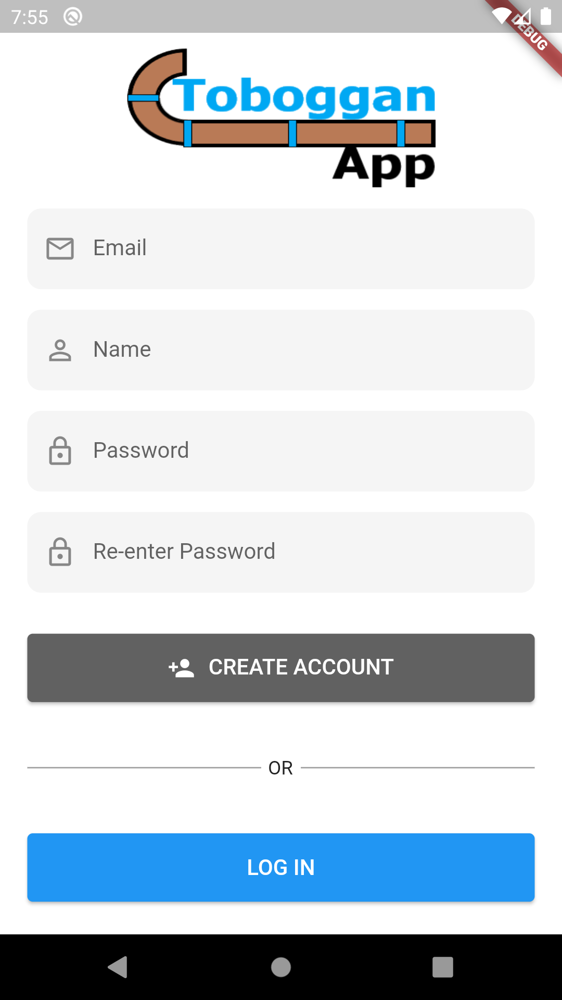
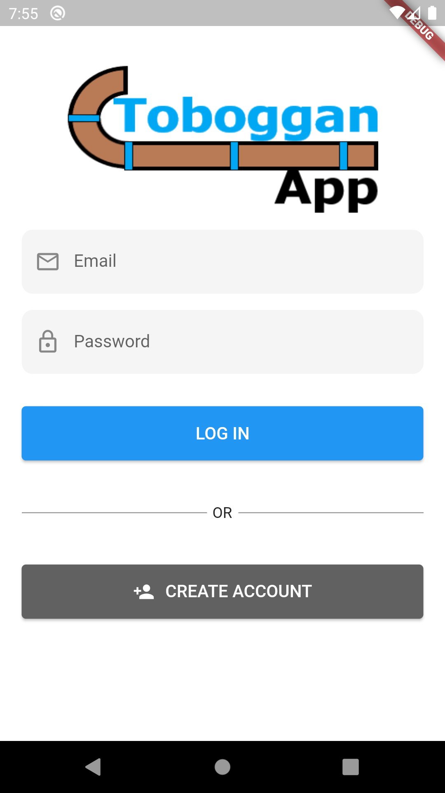

# tobogganapp - Group 11

## Group Members

<ul>
  <li>Taylor Young</li>
  <li>Peter Regas</li>
  <li>Shayan Khosravi</li>
  <li>Sirichai Justin Wong</li>
</ul>

## Description
Finding hills to toboggan on is a very ambiguous process that involves a lot of google searching and word of mouth exchanges. The goal of this project is to help connect the tobogganing community, from families looking for a fun day out with the kids to a group of enthusiasts looking for the next great hill, our app will provide everything needed to find, contribute, learn about, and rate hills.
 
When first opening the app you will be greeted by a map of your local area with toboggan hills marked, you can then click on these hills or search for a new location. Once you click on the hill you will be provided with the most up to date information provided by users including rating, pictures, and reviews as well as information provided by the app such as current temperature near the hill and address. Another way to browse the app includes a scrolling feed of hills sorted by distance and will include the name of each hill, picture (if available), and the address with the option to get directions. Another feature of the app will be accounts, once signed in you then have access to reviewing and uploading pictures of hills for the community to see as well as personal features such as bookmarking your favorite hills. With this app we hope to provide the tobogganing community an easy to use all in one hill suite to make sure their time is spent on the hill not finding a hill.

## Create Account
This page is responisble for user account registration, it is linked to the firebase authentication service, where it creates a new document for a registering user.

## Login Account

This page is responisble for user login, it is linked to the firebase authentication service, where it validates user credentials.

